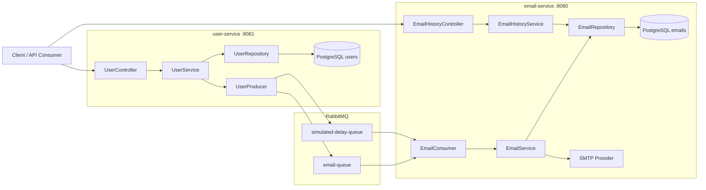
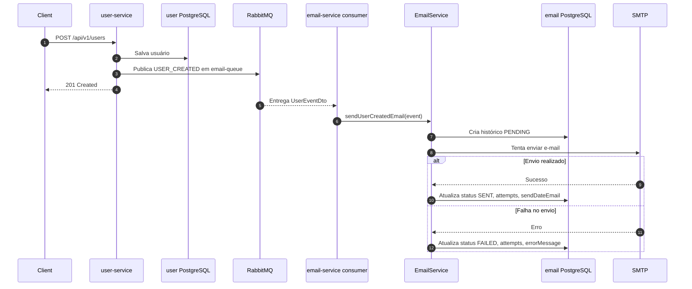
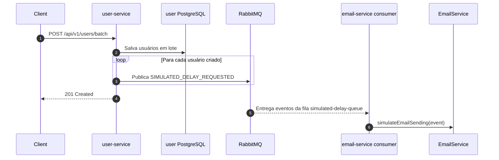
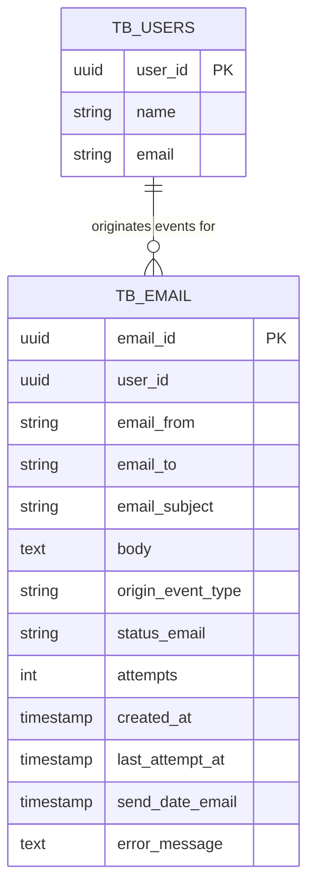

# User Mail Sender MS

Plataforma de microserviços para cadastro de usuários, publicação de eventos e processamento assíncrono de e-mails com histórico de envio.

O projeto é composto por dois serviços Spring Boot independentes:

- `user-service`: gerencia usuários e publica eventos de domínio.
- `email-service`: consome eventos, processa envios de e-mail e disponibiliza consultas do histórico de envio.

A comunicação entre os serviços é assíncrona via RabbitMQ. Cada serviço possui seu próprio banco PostgreSQL, mantendo isolamento de dados e responsabilidade por domínio.

## Arquitetura



### Responsabilidades

| Componente | Responsabilidade |
| --- | --- |
| `user-service` | CRUD de usuários e publicação de eventos relacionados ao usuário. |
| `email-service` | Consumo de eventos, envio de e-mails e consulta do histórico de envio. |
| RabbitMQ | Transporte assíncrono dos eventos entre serviços. |
| PostgreSQL `user` | Persistência exclusiva dos dados de usuários. |
| PostgreSQL `email` | Persistência exclusiva dos registros de envio e histórico de e-mails. |

## Fluxos Principais

### Criação de usuário e envio de e-mail



### Criação de usuários em lote



### Consulta do histórico de e-mails

```mermaid
flowchart TD
    Client[Client / API Consumer]
    Controller[EmailHistoryController]
    Service[EmailHistoryService]
    Repository[EmailRepository]
    Database[(email PostgreSQL)]

    Client -->|GET /api/v1/emails| Controller
    Client -->|GET /api/v1/emails/{emailId}| Controller
    Client -->|GET /api/v1/emails/users/{userId}| Controller
    Client -->|GET /api/v1/emails/status/{status}| Controller
    Controller --> Service
    Service --> Repository
    Repository --> Database
```

## Modelo de Dados



`TB_USERS` e `TB_EMAIL` pertencem a bancos diferentes. A relação acima é lógica, não uma foreign key entre bancos.

## Contrato de Eventos

Os eventos publicados pelo `user-service` usam o payload `UserEventDto`.

```json
{
  "userId": "11111111-1111-1111-1111-111111111111",
  "name": "Joao Silva",
  "email": "joao.silva@email.com",
  "eventType": "USER_CREATED"
}
```

### Tipos de evento

| Evento | Origem | Fila | Descrição |
| --- | --- | --- | --- |
| `USER_CREATED` | `POST /api/v1/users` | `email-queue` | Solicita envio de e-mail após criação de usuário. |
| `SIMULATED_DELAY_REQUESTED` | `POST /api/v1/users/batch` | `simulated-delay-queue` | Dispara processamento simulado com delay para cada usuário criado em lote. |

### Filas

As filas são configuradas nos arquivos `application.yml` por meio de `app.rabbitmq.queues`.

```yaml
app:
  rabbitmq:
    queues:
      email-notification: email-queue
      simulated-delay: simulated-delay-queue
```

O `email-service` declara as filas em `RabbitMqConfig`. O `user-service` publica nas filas configuradas usando `RabbitTemplate` e `Jackson2JsonMessageConverter`.

## Histórico de Envio

O histórico é armazenado no `email-service`, porque esse serviço é o dono do envio e conhece o resultado final da operação.

Cada registro responde às principais perguntas operacionais:

| Pergunta | Campo |
| --- | --- |
| Esse e-mail foi enviado? | `statusEmail == SENT` |
| Para quem foi enviado? | `emailTo` |
| Qual evento originou o envio? | `originEventType` |
| Deu erro? | `statusEmail == FAILED` |
| Quantas tentativas teve? | `attempts` |
| Quando foi enviado? | `sendDateEmail` |
| Quando ocorreu a última tentativa? | `lastAttemptAt` |
| Qual mensagem de erro retornou? | `errorMessage` |

### Status de e-mail

| Status | Descrição |
| --- | --- |
| `PENDING` | Registro criado antes da tentativa de envio. |
| `SENT` | E-mail enviado com sucesso. |
| `FAILED` | Envio falhou e a mensagem de erro foi registrada. |
| `DELIVERED` | Reservado para confirmação futura de entrega. |

## APIs

### User Service

Base URL:

```text
http://localhost:8081/api/v1/users
```

| Método | Endpoint | Descrição |
| --- | --- | --- |
| `POST` | `/api/v1/users` | Cria um usuário e publica evento `USER_CREATED`. |
| `POST` | `/api/v1/users/batch` | Cria usuários em lote e publica eventos `SIMULATED_DELAY_REQUESTED`. |
| `GET` | `/api/v1/users` | Lista todos os usuários. |
| `GET` | `/api/v1/users/{userId}` | Busca usuário por ID. |
| `PUT` | `/api/v1/users/{userId}` | Atualiza todos os campos editáveis do usuário. |
| `PATCH` | `/api/v1/users/{userId}` | Atualiza parcialmente os campos enviados. |
| `DELETE` | `/api/v1/users/{userId}` | Remove usuário por ID. |

#### Criar usuário

```bash
curl -X POST http://localhost:8081/api/v1/users \
  -H "Content-Type: application/json" \
  -d '{
    "name": "Joao Silva",
    "email": "joao.silva@email.com"
  }'
```

#### Criar usuários em lote

```bash
curl -X POST http://localhost:8081/api/v1/users/batch \
  -H "Content-Type: application/json" \
  -d '[
    {
      "name": "Joao Silva",
      "email": "joao.silva@email.com"
    },
    {
      "name": "Maria Souza",
      "email": "maria.souza@email.com"
    }
  ]'
```

#### Atualizar usuário

```bash
curl -X PUT http://localhost:8081/api/v1/users/11111111-1111-1111-1111-111111111111 \
  -H "Content-Type: application/json" \
  -d '{
    "name": "Joao Silva Atualizado",
    "email": "joao.atualizado@email.com"
  }'
```

#### Atualizar parcialmente

```bash
curl -X PATCH http://localhost:8081/api/v1/users/11111111-1111-1111-1111-111111111111 \
  -H "Content-Type: application/json" \
  -d '{
    "name": "Joao Parcial"
  }'
```

### Email Service

Base URL:

```text
http://localhost:8080/api/v1/emails
```

| Método | Endpoint | Descrição |
| --- | --- | --- |
| `GET` | `/api/v1/emails` | Lista todos os registros de envio. |
| `GET` | `/api/v1/emails/{emailId}` | Busca um registro de envio por ID. |
| `GET` | `/api/v1/emails/users/{userId}` | Lista envios relacionados a um usuário. |
| `GET` | `/api/v1/emails/status/{status}` | Lista envios por status. |

#### Consultar histórico

```bash
curl http://localhost:8080/api/v1/emails
```

```bash
curl http://localhost:8080/api/v1/emails/11111111-1111-1111-1111-111111111111
```

```bash
curl http://localhost:8080/api/v1/emails/users/22222222-2222-2222-2222-222222222222
```

```bash
curl http://localhost:8080/api/v1/emails/status/SENT
curl http://localhost:8080/api/v1/emails/status/FAILED
```

## Respostas de Erro

Os serviços retornam erros em formato padronizado.

```json
{
  "timestamp": "2026-06-17T19:00:00-03:00",
  "status": 404,
  "error": "Not Found",
  "message": "Recurso não encontrado",
  "path": "/api/v1/resource/id",
  "fields": null
}
```

Validações de entrada retornam `400 Bad Request`. Recursos inexistentes retornam `404 Not Found`.

## Execução Local

### Pré-requisitos

- Java 17
- Maven
- Docker
- Docker Compose

### Portas

| Recurso | Porta |
| --- | --- |
| `user-service` | `8081` |
| `email-service` | `8080` |
| RabbitMQ | `5672` |
| RabbitMQ Management | `15672` |
| PostgreSQL `user` | `5435` |
| PostgreSQL `email` | `5433` |

### Subir RabbitMQ

```bash
docker run -d --name rabbitmq-local \
  -p 5672:5672 \
  -p 15672:15672 \
  rabbitmq:3-management
```

Painel:

```text
http://localhost:15672
login: guest
senha: guest
```

### Subir bancos locais

```bash
cd user
docker compose up -d
```

```bash
cd email
docker compose up -d
```

### Rodar serviços

```bash
cd email
mvn spring-boot:run
```

```bash
cd user
./mvnw spring-boot:run
```

O arquivo `commands.bash` contém uma sequência de comandos útil para execução manual local.

## Configuração

### RabbitMQ

```yaml
spring:
  rabbitmq:
    addresses: amqp://localhost:5672
    username: guest
    password: guest
    virtual-host: /
```

### SMTP

O `email-service` usa `spring.mail.*` para envio real de e-mails. Em ambiente local, credenciais inválidas fazem o envio falhar e o histórico é gravado com status `FAILED` e `errorMessage`.

## Decisões Técnicas

- **Isolamento por serviço**: cada microserviço possui banco próprio e não acessa diretamente os dados do outro serviço.
- **Comunicação assíncrona**: o `user-service` não espera o envio de e-mail para responder ao cliente.
- **Histórico no serviço dono do envio**: o `email-service` registra tentativas, status e erros porque é o único serviço que conhece o resultado do envio.
- **Contratos explícitos**: eventos usam DTOs dedicados e filas configuradas por propriedades.
- **Tratamento padronizado de erros**: exceções REST são convertidas em respostas consistentes.

## Limitações Atuais

- Não há autenticação/autorização.
- Não há retry automático real.
- Não há dead letter queue.
- Não há paginação nas consultas de histórico.
- Não há rastreamento distribuído entre os serviços.
- `DELIVERED` está reservado, mas ainda não há confirmação de entrega pelo provedor SMTP.

## Próximos Passos Recomendados

- Adicionar paginação e filtros avançados no histórico de e-mails.
- Implementar retry com backoff e dead letter queue.
- Adicionar correlation ID nos eventos e logs.
- Criar testes de integração com RabbitMQ e PostgreSQL via Testcontainers.
- Proteger APIs com autenticação.
- Adicionar observabilidade com métricas, tracing e logs estruturados.
