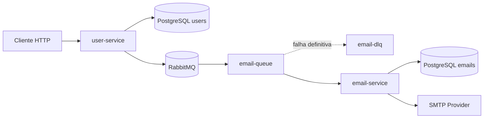

# User Mail Sender MS

Projeto de estudo sobre microserviços com Spring Boot, comunicação assíncrona com RabbitMQ, persistência isolada por serviço e processamento confiável de envio de e-mails.

A aplicação simula um cenário comum em sistemas distribuídos: um serviço cadastra usuários e publica eventos; outro serviço consome esses eventos, envia e-mails e mantém um histórico do processamento.

## Objetivo do Projeto

Este projeto foi construído para estudar, de forma prática:

- separação de responsabilidades entre microserviços;
- comunicação assíncrona com RabbitMQ;
- publicação e consumo de eventos;
- persistência com PostgreSQL e Flyway;
- histórico operacional de processamento;
- retry automático com exponential backoff;
- Dead Letter Queue para falhas definitivas.

O foco não é criar uma plataforma completa de e-mail, mas demonstrar boas práticas iniciais de mensageria e resiliência em um ambiente simples de executar localmente.

## Visão Geral da Arquitetura



O `user-service` não envia e-mails diretamente. Ele apenas publica eventos no RabbitMQ. O `email-service` é o responsável por consumir esses eventos, tentar o envio e registrar o resultado.

## Serviços

| Serviço | Porta | Responsabilidade | Banco |
| --- | --- | --- | --- |
| `user-service` | `8081` | CRUD de usuários e publicação de eventos | PostgreSQL `ms-user-ms` |
| `email-service` | `8080` | Consumo de eventos, envio de e-mails e histórico | PostgreSQL `ms_email_ms` |

## Componentes Principais

| Componente | Função |
| --- | --- |
| `UserController` | Expõe os endpoints de usuários. |
| `UserService` | Executa as regras de cadastro, atualização e remoção de usuários. |
| `UserProducer` | Publica eventos no RabbitMQ. |
| `EmailConsumer` | Consome eventos das filas RabbitMQ. |
| `EmailService` | Monta o e-mail, envia via SMTP e atualiza o histórico. |
| `EmailHistoryController` | Expõe endpoints para consultar o histórico de e-mails. |
| `EmailRepository` | Persiste e consulta registros da tabela de e-mails. |
| `RabbitMqConfig` | Declara filas, DLQ, conversor JSON e retry com backoff. |

## Fluxo Principal

O fluxo principal começa quando um usuário é criado.

1. O cliente chama `POST /api/v1/users` no `user-service`.
2. O `user-service` salva o usuário no seu banco PostgreSQL.
3. O `user-service` publica um evento `USER_CREATED` na fila `email-queue`.
4. O `email-service` consome a mensagem da fila.
5. O `email-service` cria ou reutiliza um registro de histórico com status `PENDING`.
6. O envio de e-mail é tentado via SMTP.
7. Se o envio funcionar, o histórico é atualizado para `SENT`.
8. Se o envio falhar, o retry automático é acionado.
9. Se todas as tentativas falharem, o histórico é atualizado para `FAILED` e a mensagem vai para a `email-dlq`.

Esse fluxo mantém o cadastro de usuários desacoplado do envio de e-mails. O usuário pode ser criado mesmo que o provedor SMTP esteja indisponível.

## Contrato de Evento

Os eventos publicados pelo `user-service` usam o payload `UserEventDto`.

```json
{
  "userId": "11111111-1111-1111-1111-111111111111",
  "name": "Joao Silva",
  "email": "joao.silva@email.com",
  "eventType": "USER_CREATED"
}
```

| Campo | Descrição |
| --- | --- |
| `userId` | Identificador do usuário que originou o evento. |
| `name` | Nome do usuário. |
| `email` | E-mail de destino. |
| `eventType` | Tipo do evento publicado. |

### Tipos de Evento

| Evento | Origem | Fila | Finalidade |
| --- | --- | --- | --- |
| `USER_CREATED` | `POST /api/v1/users` | `email-queue` | Solicitar envio de e-mail de cadastro. |
| `SIMULATED_DELAY_REQUESTED` | `POST /api/v1/users/batch` | `simulated-delay-queue` | Simular processamento em lote com delay. |

## Filas RabbitMQ

As filas são configuradas em `application.yml`.

```yaml
app:
  rabbitmq:
    exchanges:
      email-dead-letter: email-dlx
    queues:
      email-notification: email-queue
      email-dead-letter: email-dlq
      simulated-delay: simulated-delay-queue
    retry:
      max-attempts: 3
      initial-interval: 2000
      multiplier: 2.0
      max-interval: 10000
```

| Fila ou exchange | Tipo | Uso |
| --- | --- | --- |
| `email-queue` | Queue | Fila principal de envio de e-mail. |
| `email-dlq` | Queue | Armazena mensagens que falharam após o limite de retries. |
| `email-dlx` | Direct exchange | Roteia mensagens rejeitadas para a DLQ. |
| `simulated-delay-queue` | Queue | Fila usada pelo fluxo de simulação em lote. |

## Retry, Backoff e DLQ

Esta é a parte mais importante do `email-service` do ponto de vista de mensageria confiável.

### Problema

Falhas de envio de e-mail podem ser temporárias. Exemplos:

- indisponibilidade momentânea do SMTP;
- falha de rede;
- timeout;
- instabilidade do provedor externo.

Se o sistema marcar o e-mail como `FAILED` na primeira falha, ele pode perder mensagens que funcionariam em uma nova tentativa. Por outro lado, se a mensagem voltar infinitamente para a fila principal, ela pode travar o consumo e gerar loop.

### Solução Aplicada

O `email-service` usa retry automático do Spring AMQP com exponential backoff.

Com a configuração atual:

- máximo de tentativas: `3`;
- primeira espera entre tentativas: `2000 ms`;
- multiplicador: `2.0`;
- intervalo máximo: `10000 ms`.

Na prática, o serviço tenta processar a mesma mensagem até três vezes. Entre as tentativas, o intervalo cresce progressivamente.

Quando as tentativas acabam, a mensagem é rejeitada sem requeue. Como a fila principal possui configuração de dead letter, o RabbitMQ move a mensagem para `email-dlq`.

### Onde Está no Código

| Arquivo | Responsabilidade |
| --- | --- |
| `email/src/main/resources/application.yml` | Define nomes de filas, DLX, DLQ e parâmetros de retry. |
| `email/src/main/java/dev/java10x/email/configuration/RabbitMqConfig.java` | Declara filas, DLQ, binding e `RetryInterceptor`. |
| `email/src/main/java/dev/java10x/email/consumer/EmailConsumer.java` | Usa o container com retry no listener da `email-queue`. |
| `email/src/main/java/dev/java10x/email/service/EmailService.java` | Atualiza histórico a cada tentativa e relança exceções para acionar retry. |
| `email/src/main/java/dev/java10x/email/repositorie/EmailRepository.java` | Busca histórico `PENDING` existente para não criar um novo registro a cada retry. |

### Resultado no Histórico

Quando o envio funciona:

| Campo | Valor esperado |
| --- | --- |
| `statusEmail` | `SENT` |
| `attempts` | Número de tentativas realizadas |
| `lastAttemptAt` | Data da última tentativa |
| `sendDateEmail` | Data do envio bem-sucedido |
| `errorMessage` | `null` |

Quando todas as tentativas falham:

| Campo | Valor esperado |
| --- | --- |
| `statusEmail` | `FAILED` |
| `attempts` | Valor final de tentativas configurado |
| `lastAttemptAt` | Data da última tentativa |
| `sendDateEmail` | `null` |
| `errorMessage` | Mensagem da causa da falha |

## Histórico de E-mails

O histórico pertence ao `email-service`, porque somente ele sabe se o envio foi realizado, quantas tentativas ocorreram e qual erro foi retornado pelo provedor SMTP.

Campos principais da tabela `TB_EMAIL`:

| Campo | Significado |
| --- | --- |
| `emailId` | Identificador do registro de histórico. |
| `userId` | Usuário que originou o evento. |
| `emailFrom` | Remetente. |
| `emailTo` | Destinatário. |
| `emailSubject` | Assunto do e-mail. |
| `body` | Corpo do e-mail. |
| `originEventType` | Evento que originou o envio. |
| `statusEmail` | Status atual do envio. |
| `attempts` | Quantidade de tentativas realizadas. |
| `createdAt` | Data de criação do histórico. |
| `lastAttemptAt` | Data da última tentativa. |
| `sendDateEmail` | Data do envio bem-sucedido. |
| `errorMessage` | Último erro registrado. |

### Status

| Status | Uso |
| --- | --- |
| `PENDING` | O envio ainda está em andamento ou aguardando novas tentativas. |
| `SENT` | O e-mail foi enviado com sucesso. |
| `FAILED` | O limite de tentativas foi esgotado. |
| `DELIVERED` | Reservado para uma confirmação futura de entrega. |

## API Reference

### User Service

Base URL:

```text
http://localhost:8081/api/v1/users
```

| Método | Endpoint | Descrição |
| --- | --- | --- |
| `POST` | `/api/v1/users` | Cria um usuário e publica evento `USER_CREATED`. |
| `POST` | `/api/v1/users/batch` | Cria usuários em lote e publica eventos de simulação. |
| `GET` | `/api/v1/users` | Lista usuários. |
| `GET` | `/api/v1/users/{userId}` | Busca usuário por ID. |
| `PUT` | `/api/v1/users/{userId}` | Atualiza todos os campos editáveis. |
| `PATCH` | `/api/v1/users/{userId}` | Atualiza parcialmente os campos enviados. |
| `DELETE` | `/api/v1/users/{userId}` | Remove usuário por ID. |

Exemplo de criação:

```bash
curl -X POST http://localhost:8081/api/v1/users \
  -H "Content-Type: application/json" \
  -d '{
    "name": "Joao Silva",
    "email": "joao.silva@email.com"
  }'
```

### Email Service

Base URL:

```text
http://localhost:8080/api/v1/emails
```

| Método | Endpoint | Descrição |
| --- | --- | --- |
| `GET` | `/api/v1/emails` | Lista todos os registros de envio. |
| `GET` | `/api/v1/emails/{emailId}` | Busca um registro por ID. |
| `GET` | `/api/v1/emails/users/{userId}` | Lista envios de um usuário. |
| `GET` | `/api/v1/emails/status/{status}` | Lista envios por status. |

Exemplos:

```bash
curl http://localhost:8080/api/v1/emails
curl http://localhost:8080/api/v1/emails/status/SENT
curl http://localhost:8080/api/v1/emails/status/FAILED
```

## Execução Local

### Pré-requisitos

- Java 17
- Maven
- Docker
- Docker Compose

### Opção Recomendada: Docker Compose

A raiz do projeto possui um `docker-compose.yml` preparado para execução local e para um deploy inicial em VPS.

Essa configuração sobe:

- `user-service`;
- `email-service`;
- RabbitMQ com Management UI;
- um único PostgreSQL;
- dois schemas no mesmo banco: um para o `user-service` e outro para o `email-service`.

Crie o arquivo `.env` a partir do exemplo:

```bash
cp .env.example .env
```

Edite o `.env` com senhas reais antes de usar em uma VPS.

Suba a stack:

```bash
docker compose --env-file .env up -d --build
```

O PostgreSQL é inicializado com os schemas configurados no `.env`:

```text
USER_DB_SCHEMA=user_service
EMAIL_DB_SCHEMA=email_service
```

Cada serviço acessa somente seu próprio schema usando credenciais próprias. Isso mantém isolamento lógico mesmo usando um único banco PostgreSQL.

### Portas

| Recurso | Porta |
| --- | --- |
| `user-service` | `8081` |
| `email-service` | `8080` |
| RabbitMQ | `5672` |
| RabbitMQ Management | `15672` |
| PostgreSQL | `5432` |

As portas podem ser alteradas no `.env`.

### Opção Manual: Serviços Fora do Docker

Também é possível rodar os serviços manualmente usando os `docker-compose.yml` internos de cada módulo apenas para os bancos.

### Subir RabbitMQ

```bash
docker run -d --name rabbitmq-local \
  -p 5672:5672 \
  -p 15672:15672 \
  rabbitmq:3-management
```

Painel de administração:

```text
http://localhost:15672
login: guest
senha: guest
```

### Subir PostgreSQL

```bash
cd user
docker compose up -d
```

```bash
cd email
docker compose up -d
```

### Rodar os Serviços

Em um terminal:

```bash
cd email
mvn spring-boot:run
```

Em outro terminal:

```bash
cd user
./mvnw spring-boot:run
```

## Como Testar

### Cenário 1: criação de usuário com publicação de evento

```bash
curl -X POST http://localhost:8081/api/v1/users \
  -H "Content-Type: application/json" \
  -d '{
    "name": "Usuario Teste",
    "email": "usuario.teste@email.com"
  }'
```

Depois consulte o histórico:

```bash
curl http://localhost:8080/api/v1/emails
```

Se o SMTP estiver configurado corretamente, o registro deve aparecer como `SENT`.

### Cenário 2: retry e DLQ

Para testar retry e DLQ localmente, deixe as credenciais SMTP inválidas no `email-service`.

1. Suba RabbitMQ, PostgreSQL e os dois serviços.
2. Crie um usuário pelo `user-service`.
3. Acompanhe os logs do `email-service`.
4. Aguarde o limite de tentativas.
5. Consulte registros com status `FAILED`.

```bash
curl http://localhost:8080/api/v1/emails/status/FAILED
```

No RabbitMQ Management, acesse:

```text
http://localhost:15672
```

Verifique se a mensagem foi enviada para `email-dlq`.

Importante: se a fila `email-queue` já existir sem argumentos de DLQ, apague a fila pelo painel ou recrie o container RabbitMQ. O RabbitMQ não permite redeclarar uma fila existente com argumentos diferentes.

## Configuração

### RabbitMQ

Configuração usada pelos dois serviços:

```yaml
spring:
  rabbitmq:
    addresses: amqp://localhost:5672
    username: guest
    password: guest
    virtual-host: /
```

### SMTP

O envio real de e-mails usa `spring.mail.*` no `email-service`.

```yaml
spring:
  mail:
    host: smtp.gmail.com
    port: 587
    username: seu-email
    password: sua-senha-ou-app-password
```

Em ambiente local, credenciais inválidas são úteis para testar retry, falha definitiva e DLQ.

## Decisões Técnicas

- **Banco por serviço**: cada microserviço possui seu próprio PostgreSQL.
- **Comunicação assíncrona**: o `user-service` não espera o envio de e-mail para responder ao cliente.
- **Histórico no serviço consumidor**: o `email-service` registra tentativas e erros porque ele é o dono do processamento.
- **Retry no consumidor**: o retry fica no `email-service`, onde a falha acontece.
- **DLQ para falha definitiva**: mensagens que não puderam ser processadas não bloqueiam a fila principal.
- **DTOs explícitos**: os eventos usam contratos próprios em vez de expor diretamente entidades JPA.
